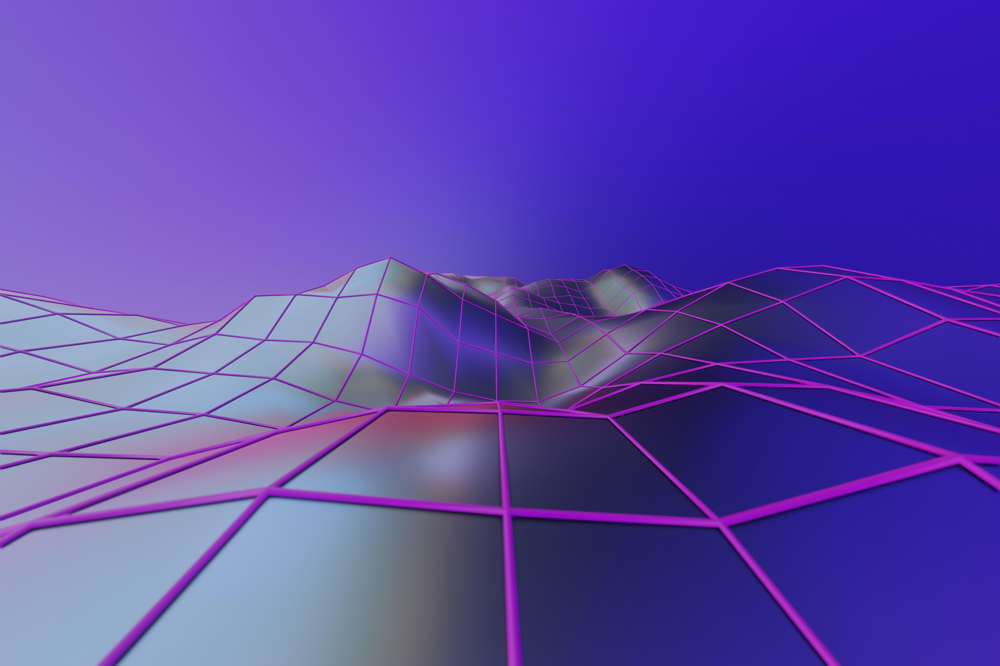

# idée projet final
## Concept 
Projection vidéo sur 3 murs avec intéractivité
## Inspiration
Mon inspiration pour le projet c'est un des projets de l'an dernier qui est Écomarine. Une projection sur trois murs qui est controler par une tablette.
## Mon idée 

Mon idée ressemble à celle d'Écomarine dans le sens sa va être des projections de vidéos que l'intéracteur va pouvoir choisir. Les vidéo vont etre sur le même thème mais différente avec des couleur vivres mais une ambiance sonore calme. Sa serait surement dans le petit studio pour permettre au inttéracteur d'etre calme et détendu pendant l'écoute des vidéo. Dans la petit studio il pourrait y avoir des pouf pour pouvoir rendre l'expérience encore plus détendu loins de toute distraction. 
Aussi je pensais aussi qu'il pourrait avoir des lumières qui s'allument ou s'éteignent qunad l'interacteur arrive ou repart ou bien une video qui commence quand une personne s'assoie sur le pouf ou  quand il entre dans la zone de visionement.
### inspiration pour la 3d 

</img> </img> </img>
>  crédit photo: unsplash)
## Ambiance
Une ambiance tranquille avec de la musique douce , lumière douce pour un moment de detente. l'intéracteur aura le choix de choisir la vidéo qu'il veut écouter ou tout simplement les faire jouer dans l'ordre qu'il veut.
### Technique 
- Détection de mouvement
- projection vidéo
- 3d
- ambiance sonore 360
- contrôle des vidéos avec manette ou autre 

