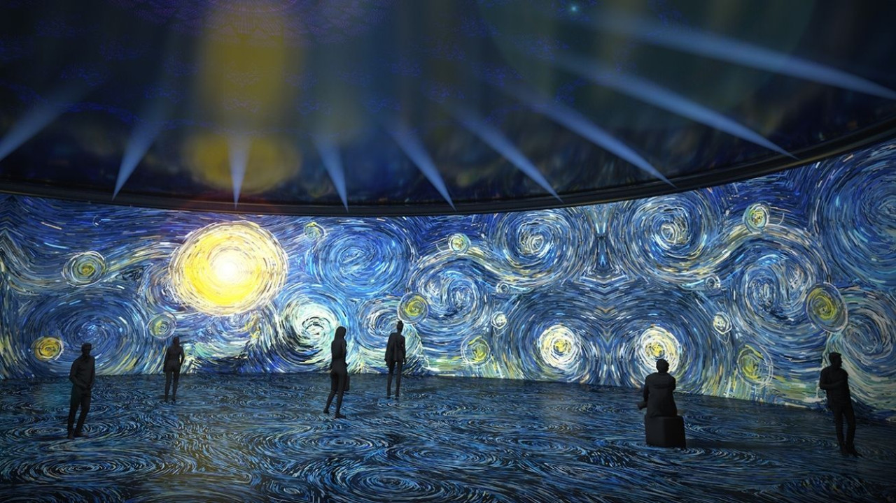

# Vidéo Intéractive
## Présentation de la conceptualisation
Projection vidéo sur 3 murs avec intéractivité
## Thème 
Notre thème serait basser sur le bien être , la relaxation 

recherche https://www.youtube.com/watch?v=RG5Fi-eCLbc, https://www.youtube.com/watch?v=H902ovpjU8o,https://www.youtube.com/watch?v=QjaTnrS0IZM 47:45, https://www.youtube.com/watch?v=lNLeRmnkug8

Dans la video on voit que plusieur méthode d'intéraction on été utiliser et plusieur en même temps se qui peut être quelque chose à explorer si on veut que plusieurs personne puisse avoir le contrôle.

On vois a l'aide de détecteur de mouvement que l'effet de lumiere suis l'intéracteur. Donc peut t'être penser a faire une projection au sol aussi et utiliser cette technique pour créer de l'intéractiviter.

[ 
pour cette video j'aimais qu'elle explique un peu les étape pour créer son intéractivité et son projet au complet et qu'elle nous montre sont processus de création.
## Mon idée 
</img> 
>  crédit photo: [Site connaissance des arts](https://www.connaissancedesarts.com/arts-expositions/art-moderne/van-gogh-goya-magritte-10-expositions-numeriques-ou-lart-nous-emerveille-11165758/)

Mon idée ressemble à celle d'Écomarine dans le sens sa va être des projections de vidéos que l'intéracteur va pouvoir choisir. Les vidéo vont etre sur le même thème mais différente avec des couleur vivres mais une ambiance sonore calme. Sa serait surement dans le petit studio pour permettre au inttéracteur d'etre calme et détendu pendant l'écoute des vidéo. l'installation pourrait être dans le petit studio, ou même dans le cyclo .il pourrait y avoir des pouf pour pouvoir rendre l'expérience encore plus détendu loins de toute distraction. 
Aussi je pensais aussi qu'il pourrait avoir des lumières qui s'allument ou s'éteignent qunad l'interacteur arrive ou repart ou bien une video qui commence quand une personne s'assoie sur le pouf ou  quand il entre dans la zone de visionement.
### Inspiration pour la 3d 

</img> </img> </img>
>  crédit photo: unsplash)
## Ambiance
Une ambiance tranquille avec de la musique douce , lumière douce pour un moment de detente. l'intéracteur aura le choix de choisir la vidéo qu'il veut écouter ou tout simplement les faire jouer dans l'ordre qu'il veut.
## Techniques
- Détection de mouvement
- projection vidéo
- 3d
- ambiance sonore 360
- contrôle des vidéos avec manette ou autre

  

